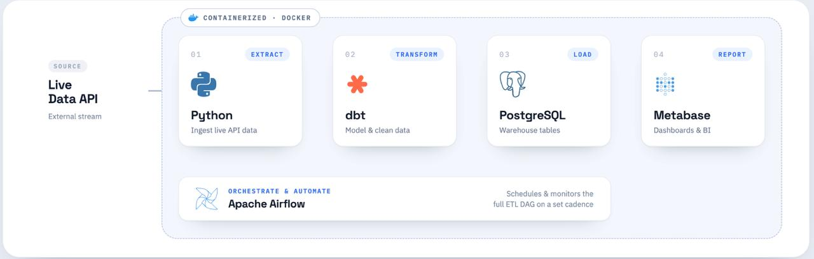

# Weather Stream: Real-Time Weather ELT Pipeline

An automated, containerized ELT (Extract, Load, Transform) data pipeline that fetches real-time weather data from the Weatherstack API, ingests it into a PostgreSQL database, transforms it using dbt (Data Build Tool), orchestrates the workflow with Apache Airflow, and visualizes the results with Metabase.

---

## 🏗️ Architecture Overview

The system runs entirely inside Docker containers, structured as follows:




### Service Breakdown & Port Mapping

| Service | Technology | Internal Port | External Port | Description |
| :--- | :--- | :--- | :--- | :--- |
| **Database** | PostgreSQL 18 | `5432` | `5000` | Data warehouse storing raw and modeled weather tables, as well as Airflow metadata. |
| **Orchestrator**| Apache Airflow 3.0.0 | `8080` | `8000` | Coordinates tasks, runs Python fetch scripts, and triggers Docker-based dbt transformations. |
| **BI Tool** | Metabase | `3000` | `3000` | Provides a web UI for creating visualizations and dashboards on transformed data. |
| **Transformer**| dbt Core (Postgres) | - | - | Runs SQL models to transform raw json-like columns into refined analytics-ready tables. |

---

## 📂 Project Structure

```text
weather-stream/
├── airflow/
│   └── dags/
│       └── orchestrator.py        # Airflow DAG defining task scheduling and execution
├── dbt/
│   ├── my_project/
│   │   ├── models/
│   │   │   ├── staging/           # Staging SQL models cleaning raw weather records
│   │   │   └── mart/              # Aggregated business models (e.g. daily averages)
│   │   └── dbt_project.yml        # dbt project configuration
│   └── profiles.yml               # Database connection profile for dbt
├── fetcher/
│   ├── api_client.py              # Weatherstack API client to retrieve weather data
│   └── insert_records.py          # Script to initialize postgres tables and insert data
├── postgres/
│   ├── airflow_init.sql           # Database setup script for Airflow
│   └── metabase_init.sql          # Database setup script for Metabase
└── docker-compose.yml             # Docker Multi-container orchestration definition
```

---

## 🚀 Getting Started

### Prerequisites
Make sure you have the following installed:
- [Docker](https://docs.docker.com/get-docker/)
- [Docker Compose](https://docs.docker.com/compose/install/)

### 1. Get a Weatherstack API Key
1. Sign up on [Weatherstack](https://weatherstack.com/) to obtain a free API key.
2. Open [fetcher/api_client.py](file:///home/mahmoud-elassy/projects/weather-stream/fetcher/api_client.py) and update the `api_key` variable:
   ```python
   api_key = 'your_weatherstack_api_key_here'
   ```

### 2. Start the Stack
Spin up the Docker containers in detached mode:
```bash
docker compose up -d
```

Verify all containers are up and running:
```bash
docker compose ps
```

### 3. Access the Interfaces
- **Apache Airflow**: [http://localhost:8000](http://localhost:8000)
  - DAG ID: `weather-api-dbt-orchestrator`
- **Metabase**: [http://localhost:3000](http://localhost:3000)
  - Connect to the PostgreSQL database with the credentials below.

---

## ⚙️ Connection Configurations

### Database Credentials
- **Host**: `db` (inside Docker network) or `localhost` (from host machine)
- **Port**: `5432` (inside Docker network) or `5000` (from host machine)
- **Username**: `db_user`
- **Password**: `db_password`
- **Database**: `weather`
- **Schema**: `dev`

---

## 🔄 Data Pipeline Workflow

1. **Extraction**: Airflow runs the `fetch_and_insert` Python task every minute, calling the Weatherstack API to get current weather data (default query: Alexandria).
2. **Loading**: The fetched record is inserted into the `dev.raw_weather_data` table in the PostgreSQL instance.
3. **Transformation**:
   - Airflow executes the `transform_weather_data` task using a `DockerOperator` that spins up a dbt container.
   - **Staging (`stg_weather_data`)**: Parses and cleanses raw database columns, mapping temperatures, descriptions, wind speed, and time.
   - **Mart (`daily_average` & `weather_report`)**: Aggregates readings to compute metrics like daily average temperature, minimums, maximums, and weather statistics.
4. **Visualization**: Analysts connect Metabase to the transformed tables in the database to build reports.
